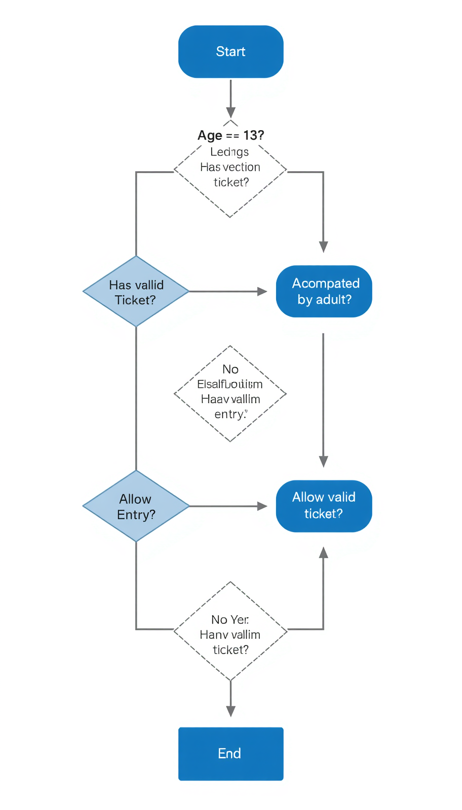

# WEEK 2 - TUTORIAL 2

## SCENARIO
A movie theater has the following admission policy. A person is allowed to enter if:
* Users are 13 years old or older, OR
* Users are accompanied by an adult, AND
* Users must have a valid ticket.

---

## ACTIVITY

### 1. Identify the Components

**1.1. What are the inputs?**
Age (Number), Accompanied by an Adult (True/False), Valid Ticket (True/False).

**1.2. What is the process?**
Evaluate if the user has a valid ticket. If true, evaluate if the user's age is 13 or older, OR if they are accompanied by an adult. Determine the final admission status based on these logical conditions.

**1.3. What is the output?**
Admission Status ("Allowed to enter" or "Not allowed to enter").

---

### 2. Design the Algorithm

**2.1. Create the diagram using draw.io / canva / etc.**

*[

**2.2. Complete the Truth Table**

| Age >= 13 (A) | Adult Present (B) | Valid Ticket (C) | Condition: (A OR B) | Result: (A OR B) AND C |
| :--- | :--- | :--- | :--- | :--- |
| True | True | True | True | **True (Allowed)** |
| True | True | False | True | **False (Denied)** |
| True | False | True | True | **True (Allowed)** |
| True | False | False | True | **False (Denied)** |
| False | True | True | True | **True (Allowed)** |
| False | True | False | True | **False (Denied)** |
| False | False | True | False | **False (Denied)** |
| False | False | False | False | **False (Denied)** |

**2.3. Design an Algorithm (The Step-by-Step Solution)**
Step 1: Start
Step 2: Input the user's age.
Step 3: Input whether the user is accompanied by an adult.
Step 4: Input whether the user has a valid ticket.
Step 5: Check if the user has a valid ticket. If false, go to Step 8.
Step 6: Check if the user's age is 13 or greater, OR if they are accompanied by an adult.
Step 7: If the condition in Step 6 is true, output "Allowed to enter" and go to Step 9.
Step 8: Output "Not allowed to enter".
Step 9: End

**2.4. Create Pseudocode**
START
  INPUT age
  INPUT has_adult
  INPUT has_ticket

  IF has_ticket == TRUE THEN
    IF age >= 13 OR has_adult == TRUE THEN
      PRINT "Allowed to enter"
    ELSE
      PRINT "Not allowed to enter"
    ENDIF
  ELSE
    PRINT "Not allowed to enter"
  ENDIF
END

---

### 3. Evaluate Expression

**3.1. Test with some input samples**

**Test Case 1**
Input: Age = 15, Adult = False, Ticket = True
Output: Allowed to enter

**Test Case 2**
Input: Age = 10, Adult = True, Ticket = True
Output: Allowed to enter

**Test Case 3**
Input: Age = 14, Adult = False, Ticket = False
Output: Not allowed to enter

**Test Case 4**
Input: Age = 11, Adult = False, Ticket = True
Output: Not allowed to enter